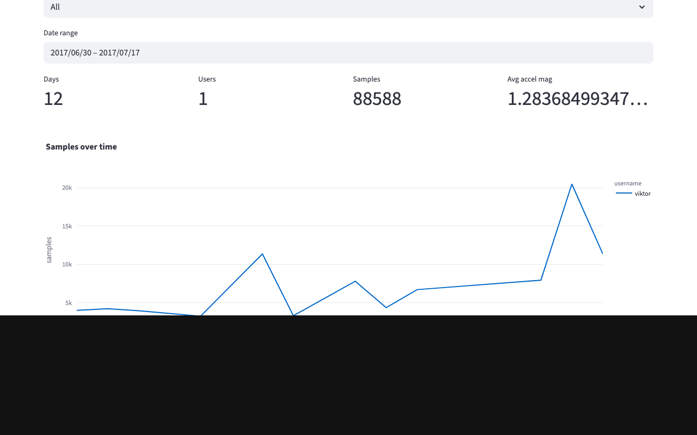

# run-walk-pipeline

Small example pipeline structure for ingesting run/walk data, transforming it, and exposing a tiny dashboard.

Problem statement
-----------------

This project demonstrates a complete end-to-end batch data pipeline for activity monitoring. The pipeline ingests raw device CSVs (run/walk samples), stores them in a Parquet data lake, transforms and materializes aggregated tables in a DuckDB data warehouse, and exposes both an interactive Streamlit dashboard and a lightweight JSON endpoint for consumers. The dashboard helps answer simple operational questions, for example: "How much activity did each user record over time?" and "What proportion of samples are running vs walking?".

Architecture
------------

Batch pipeline (high level):

CSV (Kaggle dataset)
	↓
Parquet (Data Lake)
	↓
DuckDB (Data Warehouse)
	↓
SQL Transformations (materialized tables)
	↓
Streamlit Dashboard + Flask API

This architecture shows the simple, file-first local workflow used in this project: ingest raw CSVs into a Parquet lake, run lightweight SQL transforms over DuckDB to produce small materialized summary tables, and expose those summaries to interactive and programmatic dashboards.

This project implements a **batch data pipeline**, executed periodically using Airflow.

Orchestration
-------------

Apache Airflow is used to orchestrate the pipeline (optional for local runs). The example DAG (`airflow/dag.py`) defines three high-level tasks:

- download dataset
- ingest CSV → Parquet
- run transformations in DuckDB

Run `airflow/dag.py` as an example DAG (see the `docker-compose.yml` for a local Airflow development setup) or run the tasks manually using the provided Makefile targets.

Run Airflow locally (docker-compose)
-----------------------------------

If you want to run the example DAG locally using Docker Compose, from the repository root:

```bash
# starts services in the background (docker compose v2)
docker compose up -d

# follow logs (optional)
docker compose logs -f

# stop and remove containers when finished
docker compose down
```

If your system uses the old `docker-compose` binary, replace `docker compose` with `docker-compose` in the commands above.

What you'll see
---------------

- Tile 1 — Activity distribution: a categorical visualization (pie chart) showing the share of samples by activity type (walking vs running). This helps understand overall activity composition.
- Tile 2 — Samples over time: a temporal line chart showing sample counts per day (and per user when selected). This helps spot trends, gaps, or anomalies in data collection.


Project layout

```text
run-walk-pipeline/
├── data/                 # raw CSVs (not checked in)
├── lake/                 # Parquet lake (generated)
│   └── parquet/
├── warehouse/            # DuckDB analytics DB (generated)
├── ingestion/            # CSV -> Parquet ingestion code
│   └── ingest.py
├── transform/            # SQL transforms
│   └── transform.sql
├── dashboard/            # dashboards (Streamlit UI + Flask JSON API)
│   ├── streamlit_app.py  # interactive Streamlit UI
│   └── app.py            # tiny Flask JSON endpoint (/summary)
├── airflow/              # example Airflow DAG
│   └── dag.py
├── requirements.txt
└── README.md
```

Quick start (macOS / zsh)

1. Create a virtualenv and install dependencies:

```bash
python3 -m venv .venv
source .venv/bin/activate
pip install -r requirements.txt
```

2. Put CSV files in `data/raw/`.

Makefile (recommended)
----------------------

This repository includes a small `Makefile` with convenient targets for local development. Using `make` is the easiest way to create the venv, download the dataset (via the downloader), run ingestion and run tests.

Common targets:

```bash
# create and activate the virtualenv and install deps
make venv

# download dataset into data/raw/ (uses .env KAGGLE_API_TOKEN or ~/.kaggle)
make download

# run the ingestion step (CSV -> Parquet)
make ingest

# run the test suite (pytest)
make test
```

If you don't have `make` available you can use the equivalent commands shown elsewhere in this README (for example `python -m ingestion.download_kaggle` and `python -m ingestion.ingest`).

Dataset source
---------------

The dataset used for this project is available on Kaggle:

https://www.kaggle.com/datasets/vmalyi/run-or-walk/data

Download the dataset manually from the above URL and place the CSV files into `data/raw/`.

Note: an optional helper script `ingestion/download_kaggle.py` exists to automate the download if you prefer (it requires Kaggle API credentials). Manual placement is the recommended approach if you don't want to store or configure credentials.

Automated download (Kaggle)
---------------------------

If you'd like to download the dataset programmatically instead of placing files into `data/raw/` manually, this repo includes a small helper script at `ingestion/download_kaggle.py`.

1. Create a `.env` file in the repository root with your Kaggle token:

```text
KAGGLE_API_TOKEN=KGAT_<base64(username:api_key)>
# Example (do not commit this file to git):
# KAGGLE_API_TOKEN=KGAT_abcd1234...
```

If you prefer the standard Kaggle credentials file, you can also place `kaggle.json` in `~/.kaggle/`.

2. Run the downloader using the project's virtualenv Python (recommended):

```bash
source .venv/bin/activate
python -m ingestion.download_kaggle
```

The script will create `~/.kaggle/kaggle.json` for the current user (derived from the token when possible), call the `kaggle` CLI to download and unzip the dataset into `data/raw/`, and list the downloaded files.

Security note: keep your `.env` file out of version control (add `.env` to `.gitignore` if necessary).

3. Run the ingestion step manually:

The ingestion script imports the repository-level `config` module, so the
recommended (reliable) way to run it is as a module from the repository root:

```bash
python -m ingestion.ingest --raw-dir data/raw --out lake/parquet/runs.parquet
```

Running `ingestion/ingest.py` directly may fail with import errors unless you
ensure the repo root is on `PYTHONPATH`. Use the `-m` form to avoid that class
of problems. (You can also use `make ingest` which runs the recommended command.)

```bash
# from repo root
PYTHONPATH=. python ingestion/ingest.py --raw-dir data/raw --out lake/parquet/runs.parquet
```

The `-m` approach is recommended because it avoids needing to set `PYTHONPATH`.

4. Transform (quick local transform, does not require Airflow):

```python
# run in a Python REPL or script
import pandas as pd
from sqlalchemy import create_engine

df = pd.read_parquet('lake/parquet/runs.parquet')
	# for a local quick transform we write the Parquet into a DuckDB file
	# and then execute SQL in transform/transform.sql against `warehouse/analytics.duckdb`.

DuckDB and materialized summaries
---------------------------------

This project uses DuckDB for local analytics. The transform SQL materializes
several small summary tables into `warehouse/analytics.duckdb` (so the dashboard
can query them quickly without scanning the full Parquet every time):

- `daily_user_summary` — per date and username aggregates (sample counts, avg/max accel/gyro, top_activity, top_wrist)
- `daily_activity_counts` — counts of each activity code per date/user
- `daily_wrist_counts` — counts of wrist values per date/user

DuckDB tables are materialized to avoid repeated scanning of Parquet files and improve dashboard performance.

Data Model
----------

Main tables:

- `daily_user_summary`: aggregated metrics per user per day
- `daily_activity_counts`: counts of walking vs running
- `daily_wrist_counts`: sensor distribution


Code mappings
-------------

The dataset uses numeric codes for activity and wrist. These map to human
readable labels as follows (also available in `run_walk_constants.py`):

- activity: `0` = walking, `1` = running
- wrist: `0` = left, `1` = right

To materialize these tables run the transform script from the repo root (recommended):

```bash
source .venv/bin/activate
python -m transform.run_transform
```

Note: DuckDB is listed in `requirements.txt`, so installing dependencies via
`pip install -r requirements.txt` (or `make venv`) will install it.

Streamlit dashboard (how to run)
--------------------------------

If you'd like the richer Streamlit dashboard (interactive plots), install the
required packages and run:

```bash
source .venv/bin/activate
pip install -r requirements.txt
streamlit run dashboard/streamlit_app.py
```

The Streamlit app will open at http://localhost:8501 by default. It prefers a
read-only connection to `warehouse/analytics.duckdb` and falls back to reading
the Parquet file if the DB file is unavailable or locked.

Note: this repository also includes a very small Flask-based dashboard at
`dashboard/app.py` that serves a JSON endpoint (`/summary`) for programmatic
access to the materialized `daily_user_summary` table. Use the Streamlit app
for interactive exploration and the Flask endpoint when you need a lightweight
HTTP JSON API (for scripts or monitoring tools).

Screenshot (placeholder)
-------------------------

If you review this project, include a screenshot of the Streamlit dashboard
here. For now there's a placeholder image you can replace with an actual
screenshot (save the file as `docs/screenshot.png` and update the path below):



Capture a screenshot automatically
---------------------------------

You can automatically capture a screenshot of the Streamlit dashboard using the
helper script `scripts/capture_streamlit_screenshot.py`. It uses Playwright to
render the page and save `docs/screenshot.png`.

Install Playwright and browser binaries into your active venv:

```bash
source .venv/bin/activate
pip install playwright
playwright install
```

Then run the script (Streamlit must be available in the venv):

```bash
python scripts/capture_streamlit_screenshot.py
```

This will start Streamlit, take a full-page screenshot, and write it to
`docs/screenshot.png` (replacing the placeholder).
```

5. Start the dashboard (Flask):

```bash
python dashboard/app.py
# open http://localhost:8080/summary
```

Notes

- The Airflow DAG is an example and may require adjusting Python path so Airflow can import the `ingestion` package.
- This repository is intentionally minimal to be a starting point. Add CI, tests and configuration as needed.

Airflow DAG (Pipeline orchestration)
-----------------------------------

An example DAG is provided at `airflow/dag.py`. It runs the sequence:

- download (ingestion.download_kaggle.download_dataset)
- ingest (ingestion.ingest.ingest_csvs_to_parquet)
- transform (transform.run_transform)

To run the DAG locally with the Airflow CLI you may need to make the
repository importable by the Airflow worker. Two common approaches:

1. Add the repo root to `PYTHONPATH` in the Airflow environment, for example:

```bash
export PYTHONPATH=$(pwd):$PYTHONPATH
airflow dags list
```

2. Alternatively, install the repository into the same Python environment
	used by Airflow (editable install during development):

```bash
pip install -e .
```

The DAG is intentionally simple and uses lazy imports inside the task
functions so the scheduler can parse the file without executing heavy code.

